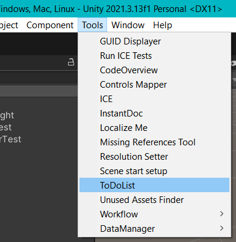
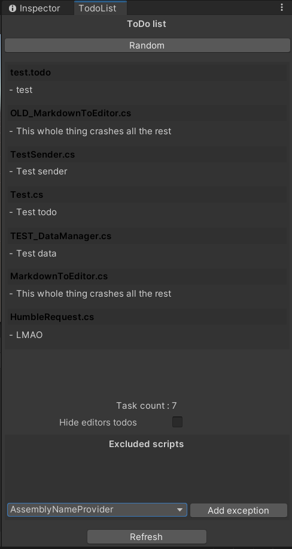
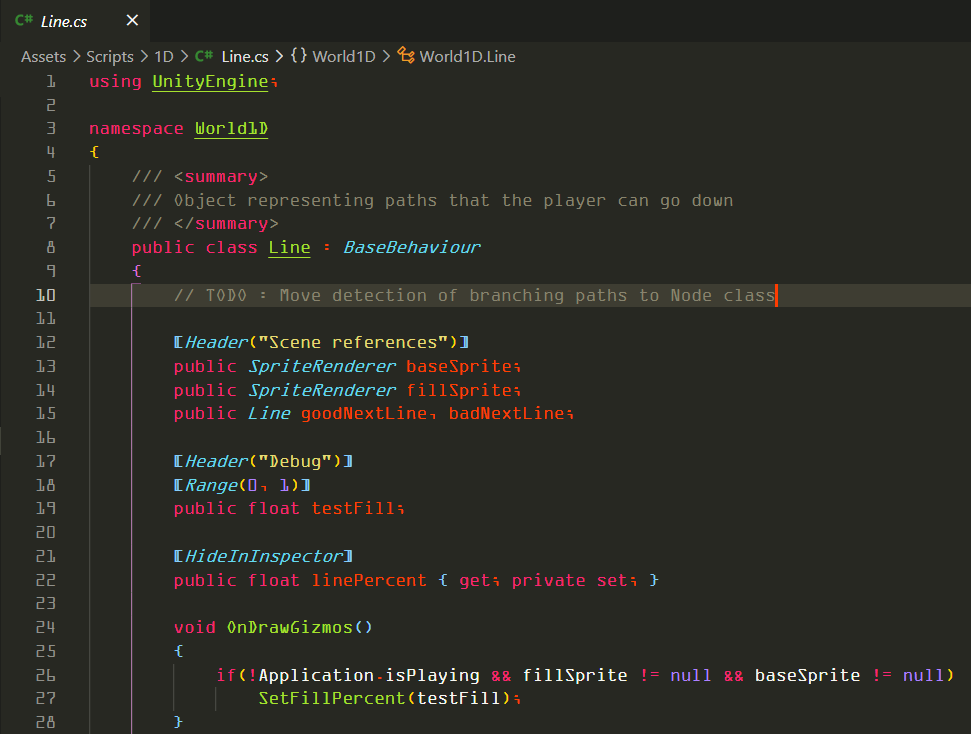
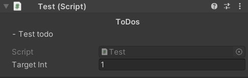

# ToDo List

_This tool is a Unity editor tool._

ToDo List is a lightweight tool to parse and compile "Todos" from your game's scripts into an editor window.

## Usage

In the Unity Editor, in the top menu bar, under the "Tools" tab you'll find "ToDoList" option.\
This will open the ToDo List editor window.

The window is separated into two sections :
- The todo list, on top.
- The excluded scripts list, on the bottom.

### Todo list

The todo list is a list of comments extracted from script files and _.todo_ text files.

To place a _todo_ in a script, place a comment line in your C# scripts starting with `"// TODO :"`.\
All the text in the same line following this flag will be parsed.

_Clicking on a script todo in the window will open the script at said line in your prefered code editor._

To place a _todo_ in a _.todo_ file, create a new text file with the extension ".todo".\
Any line starting with "- " will be parsed.

### Excluded scripts

The "Excluded scripts" section will list all scripts from which _todos_ will not be parsed (very usefull to remove _todos_ added in third party tools).

You can select a script to exclude using the dropdown present at the bottom of the "Excluded scripts" section and then press the "Add exception" button to add that script to the excluded list.\
The list of excluded files is persistent.

The only files which can be selected for exclusion are scripts.

### Additional options

- Components and ScriptableObjects will have an additional section above their editor displaying the _todos_ present in this script.

- "Hide editors todos" will hide the _todos_ displayed above Components and ScriptableObjects in the inspector.
- The "Random" button on top of the window will select a random todo in the list and display it next to the button.
- The "Refresh" button will re-parse the scripts and _.todo_ files.